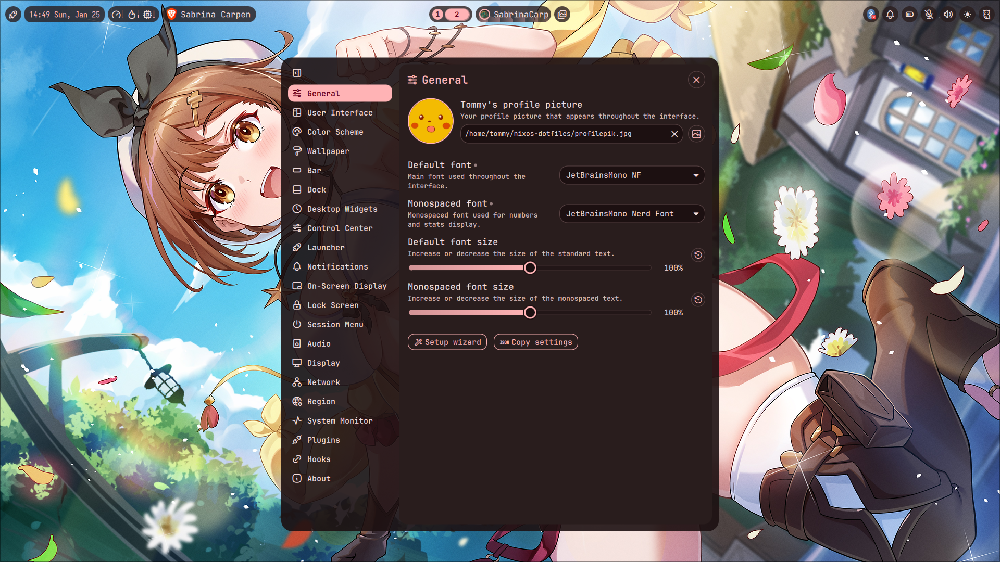

##--------
##Warning!
##--------

This is a hobby project using Nixos with Hyprland and Noctalia-shell.

This is just a test readme.
In the future I plan to update it so anyone can easily install and modify it.

make config changes in nixos-dotfiles/config also home.nix
When Downloaded, hardware.nix file should be replaced with the system one.

### **TODO**
- add abook isync msmtp notmuch urlscan support for neomutt

### **NOTE**

Neomutt sourced passwords.ggp contains similiar scheme

\# User  
set from = "<your_email_name>@gmail.com"  
set realname = "Your Name"  

\# Gmail  
set imap_user = "your_email_name@gmail.com"  
set smtp_url = "smtps://<your_email_name>@gmail.com:<your_app_password>@smtp.gmail.com:465/"  
set smtp_authenticators = 'gssapi:login'  
set imap_pass = "your_app_password"  
set smtp_pass = "your_app_password"  
