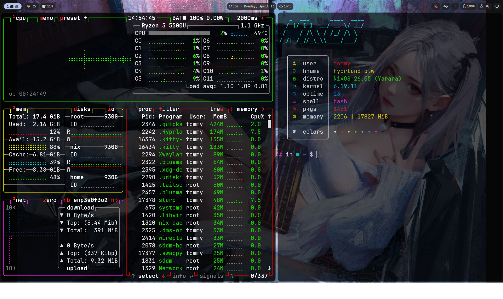

## Warning!

This is a hobby project using Nixos with Hyprland and ~~Noctalia-shell~~ DankMaterialShell (my simple quickshell bar was replaces by it).




This is just a test readme.
In the future I plan to update it so anyone can easily install and modify it.

### **INSTALL**
Clone the repo:

```git clone https://github.com/tamasbekesi99/main```

Make config changes in **nixos-dotfiles/configuratoin** also **home.nix**
When downloaded, the **hardware.nix file should be replaced** with the system one.

Replace the hostname with your own and run:

```NIX_CONFIG="experimental-features = nix-command flakes" sudo nixos-rebuild switch --flake .#HOSTNAME```

### **TODO**
- add abook isync msmtp notmuch urlscan support for neomutt

### **NOTE**

Neomutt sourced passwords.ggp contains similiar scheme

\# User  
set from = "<your_email_name>@gmail.com"  
set realname = "Your Name"  

\# Gmail  
set imap_user = "your_email_name@gmail.com"  
set smtp_url = "smtps://<your_email_name>@gmail.com:<your_app_password>@smtp.gmail.com:465/"  
set smtp_authenticators = 'gssapi:login'  
set imap_pass = "your_app_password"  
set smtp_pass = "your_app_password"  
